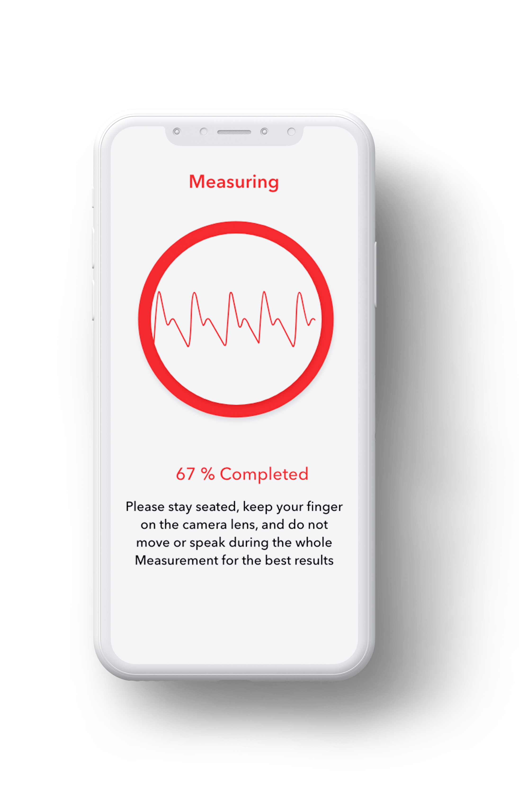

```{r echo = FALSE, include = FALSE}
library(tidyverse)
library(PPGtools)
library(DT)
library(PPGtools)
library(spam)
library(xtable)
library(cowplot)
library(ggthemes)
library(plotly)

cbp2 <- c("#000000", "#E69F00", "#56B4E9", "#009E73",
          "#F0E442", "#0072B2", "#D55E00", "#CC79A7")

```

## Some highlights of my project 
<div class="columns-2">
<center></center>

\

- Arrhythmia detection
- Smartphone cameras can measure heart rhythm
- But the signal is very noisy
- Improve SNR by filtering
- R-package ` PPGtools` 
  

</div>


## The raw data 1/2 {.smaller}

```{r echo = FALSE}
datatable(rec, filter = 'bottom', options = list(
  pageLength = 10, autoWidth = TRUE
))
```

## The raw data 2/2 
<center>
```{r, warning = FALSE, echo = FALSE}
  ggplot(data.frame(rec), aes(x = time)) +
  #geom_line(aes(y=Red), colour = cbp2[7]) +
  geom_line(aes(y=Green), colour = cbp2[1]) +
  #geom_line(aes(y=Blue), colour = cbp2[6]) + 
  labs(x = "Time (s)", y = "") +
  scale_x_continuous(limits = c(10, 80)) + 
  scale_y_continuous(limits = c(.15, .25)) + 
  theme_cowplot() + 
  theme(legend.position = "none")
```
</center>

## Filtering noisy data [@Eilers2003] {.smaller}
Find $z$ that minimizes penalized likelihood function $Q$. 

Two goals are balanced: 1) fit to the data $y$ and 2) roughness of $z$ 

\
\

   
$$ Q = |\mathbf{y - z}|^2 + \lambda|\mathbf{Dz}|^2 \\ $$
    
$$ \frac{\partial Q}{\partial \mathbf{z'}} = -2(\mathbf{y-z}) + 2\lambda\mathbf{D'Dz} \\ $$
 
$$ \mathbf{y} = (\mathbf{I} + \lambda\mathbf{D'D})\mathbf{z}  \\ $$
 
$$ \mathbf{z}  = (\mathbf{I} + \lambda\mathbf{D'D})^{-1} \mathbf{y} $$
  
## The equation part is done!  
<center>

</center>

## Problem: timesteps are of unequal length

```{r echo = FALSE}
tdiff <- data.frame(#equal = diff(seq(1:length(rec$time))), 
                    diff1 = diff(rec[,"time"]))
timedist <-
  ggplot(tdiff, aes(diff1, colour = diff1)) +
  geom_histogram(bins = 50, colour=NA, fill=cbp2[1]) + 
  labs(x = "Interval length", y = "") +
  scale_x_continuous(breaks=seq(0.01,0.09, 0.01)) +
  scale_y_continuous(
    # don't expand y scale at the lower end
    expand = expand_scale(mult = c(0, 0.05))) + 
  theme_cowplot()

timedist
```


## workflow PPGtools {.smaller}

```{r eval = FALSE}

library(PPGtools)

# prepare data
raw_signal <- prepInput(rec, channel = "Green", tstart = 20, tstop = 40)

# smooth series z
lambda <- matrix(10^(seq(-1, 5, 2)), dimnames = list(paste0('lambda_', 1:4), NULL))
z <- smoothWE(raw_signal = raw_signal, lambda = lambda, d=2, uni = TRUE)

# plot results
title <- "Uniform sampling assumed, d=2, lambda = 10^-1, 10^1, 10^3, 10^5"
plotLambda(raw_signal = raw_signal, z = z, title = title)
```


```{r echo = FALSE, warning = FALSE}
lambda<- 10^(seq(-1, 5, 2))
lambda <- matrix(lambda, dimnames = list(paste0('lambda_', 1:length(lambda)), NULL))

# prepare data
raw_signal <- prepInput(rec, channel = "Green", tstart = 10, tstop = 80)

# smooth series z
zES <- smoothWE(raw_signal = raw_signal, lambda = lambda, d=2, uni = TRUE)
raw_signal$time_scaled <- raw_signal$time * 30
zUES <- smoothWE(raw_signal = raw_signal, lambda = lambda, d=2, uni = FALSE)

pdata <- data.frame(raw_signal, 
                    zES, 
                    zUES)

# detrendES <- data.frame(raw_signal, 
#                         ES = raw_signal$Green-zES[,"l3"]) 
# 
# raw_signal2 <- raw_signal
# raw_signal2$Green <- raw_signal$Green - zES[,"l3"]

# lo <- 0.001819701
# lo <- smoothWE(raw_signal = raw_signal2, lambda = matrix(lo), d=2, uni = TRUE)
# hi <- 0.0007585776
# hi <- smoothWE(raw_signal = raw_signal2, lambda = matrix(hi), d=2, uni = TRUE)
# 
# detrendES$lo <- lo
# detrendES$hi <- hi
```


## Filtering raw data
<center>
```{r, warning = FALSE, echo = FALSE}
smoothed <- 
  ggplot(pdata, aes(x = time)) +
  #geom_line(aes(y=Red), colour = cbp2[7]) +
  geom_point(aes(y=Green), colour = cbp2[1], size = 0.3) +
  #geom_line(aes(y=Blue), colour = cbp2[6]) + 
  labs(x = "Time (s)", y = "") +
  scale_x_continuous(limits = c(40, 60)) + 
  #scale_y_continuous(limits = c(.15, .25)) + 
  theme_cowplot() + 
  theme(legend.position = "right") + 
  geom_line(aes(y=l1), colour = cbp2[5]) + 
  geom_line(aes(y=l1.1), colour = cbp2[6])

ggplotly(smoothed)
```
</center>

## Other steps
- cross-validation
- interpolation
- peak detection
- feature extraction

## References 
